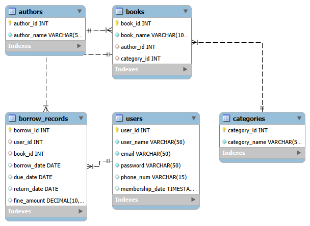

# 📚 Online Library Management System (Database Project)

## 📌 Overview

This project is a **relational database system** designed for managing a library. It allows users to borrow and return books, while maintaining records of authors, categories, and transactions.

The database is built using **MySQL** and demonstrates core database concepts such as:

* Primary Keys & Foreign Keys
* Table Relationships
* Joins (INNER JOIN)
* Data Integrity
* CRUD Operations

---

## 🧱 Database Structure

The system consists of the following tables:

### 1. Users

Stores information about library members.

* user_id (Primary Key)
* user_name
* email
* password
* phone_num
* membership_date

---

### 2. Authors

Stores book authors.

* author_id (Primary Key)
* author_name

---

### 3. Categories

Stores book categories.

* category_id (Primary Key)
* category_name

---

### 4. Books

Stores book details and links to authors and categories.

* book_id (Primary Key)
* book_name
* author_id (Foreign Key)
* category_id (Foreign Key)

---

### 5. Borrow Records

Tracks borrowing activity.

* borrow_id (Primary Key)
* user_id (Foreign Key)
* book_id (Foreign Key)
* borrow_date
* due_date
* return_date
* fine_amount

---

## 🔗 Relationships

* One **user** can borrow many books (1-to-Many)
* One **book** belongs to one category (Many-to-1)
* One **author** can write many books (1-to-Many)
* Borrow records connect **users and books**

---

## ⚙️ Features Implemented

* User registration and management
* Book management (with author & category)
* Borrow and return tracking
* Due date and fine handling
* Data retrieval using JOIN queries

---

## 🔍 Sample Queries

### 📖 Borrowed Books with Users

```sql
SELECT u.user_name, b.book_name, br.borrow_date
FROM borrow_records br
INNER JOIN users u ON br.user_id = u.user_id
INNER JOIN books b ON br.book_id = b.book_id;
